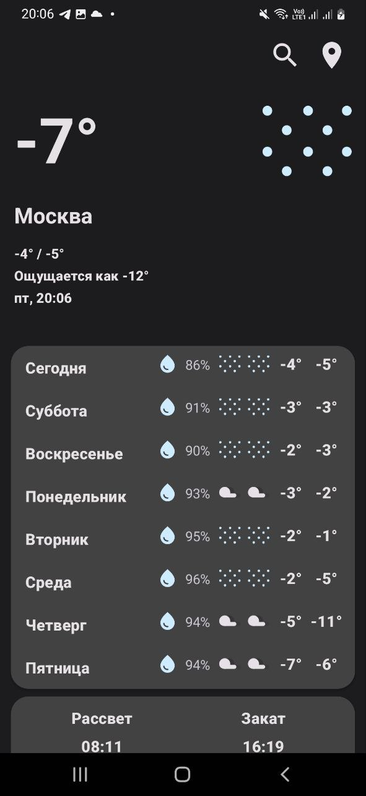

 
  
  

# Weather Adventure - Погодное приложение

# Архитектура - MVVM

# Инжект зависимостей - Dagger2

#Скрины:
:---------------------------------------------------------:
## **Темная тема**

 
  
  
  

 
  
  
  

 
  
  
  
  

  
## **Светлая тема**

 
  
  
  

  

   
  
  
  
  

